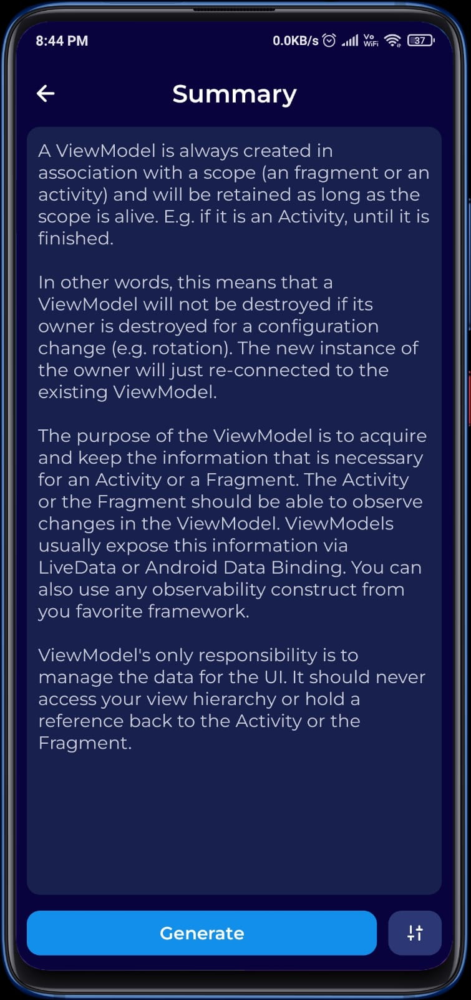

# Chomu: Your AI Writing and Assistant Companion 🤖📝

Chomu is an innovative Android app harnessing the power of generative AI to elevate your writing and productivity. Whether you need assistance in crafting emails, academic writing, creating engaging social media content, summarizing articles, or polishing your grammar, Chomu has got you covered. Additionally, Chomu serves as your interview preparation buddy, offering support for various roles and experience levels. Engage in insightful conversations with your personal AI assistant, Chomu, and unlock a new realm of possibilities!

## Table of Contents

- [Screenshots](#screenshots)
- [Installation](#installation)
- [License](#license)
- [Contribute](#how-to-contribute)

## Screenshots

|  |  |  |  |
| -------------------------- | -------------------------- | -------------------------- | -------------------------- | 
 |  |  |  |

## Installation

### Manual Installation
1. Clone this repository to your local machine using the following command:

```
git clone https://github.com/SidharthMudgil/chomu.git
```

2. Open the project in Android Studio.

3. Build the project and install it on your Android device.

### APK Installation
1. Download the [latest APK](https://github.com/SidharthMudgil/chomu/releases/latest) file from the "Releases" section of this GitHub repository.

2. Enable "Unknown Sources" in your Android device settings to allow the installation of apps from external sources.

3. Locate the downloaded APK file and install it on your Android device.

### API Key Configuration
Add your API key to the project by following these steps:

1. Open the local.properties file in the root directory of your project.

2. Add the following line with your API key:

```
API_KEY=your_api_key
```

## License
This project is licensed under the [GPL-3.0](LICENSE).

## How to Contribute
Excited to contribute to Chomu? Please read our [Contribution Guidelines](CONTRIBUTING.md) to get started. Your ideas and expertise are welcome!
